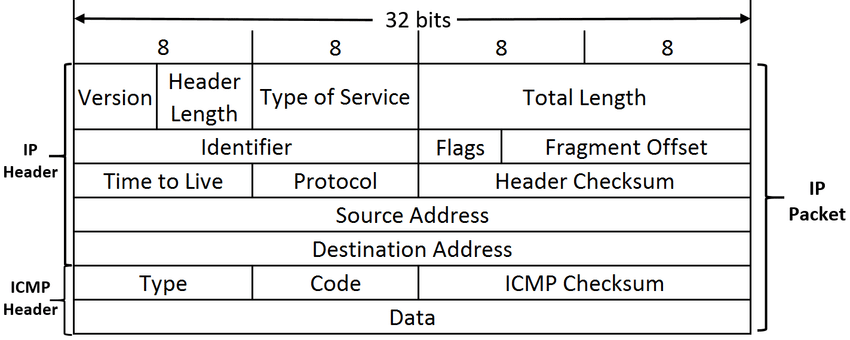
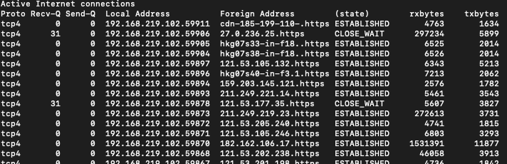

# 2.1.4 네트워크 성능 분석 명령어

>병목 현상의 주된 원인
- 네트워크 대역폭
- 네트워크 토폴로지
- 서버 CPU, 메모리 사용량
- 비효율적인 네트워크 구성

## ping

- Packet INternet Groper
- 네트워크 상태를 확인하려는 대상 노드를 향해 일정 크기의 패킷을 전송하는 명령어
- ping은 TCP/IP 프로토콜 중에 ICMP 프로토콜을 통해 동작한다.
	- ICMP
  	
    - Internet Control Message Protocol
    - 인터넷 제어 메시지 프로토콜
    - 네트워크 계층으로 IP 프로토콜과 같이 사용한다.
    -  네트워크 내 장치가 데이터 전송과 관련된 에러를 전달하기 위해 사용하는 프로토콜으로
      `IP 헤더에 기록되어 있는 출발지 호스트로 에러에 대한 정보를 보내준다.`

- `Type`
  - ICMP 패킷의 종류를 의미 
- `Code`
  - Type을 좀더 자세히 분류합니다.
- `Checksum`
  - 코드에 오류가 없는지 확인하는 용도의 Checksum
- `Additional header field`
  - Type에 따라 쓸수도 있고, 안쓸수도 있는 부분 
  - 안쓴다면 0으로 가득차 있습니다.
- `PayLoad`
  - 직접적인 데이터 내용

## netstat

- network statistics
- 네트워크의 문제를 찾아낸다. 
- `성능 측정으로서 네트워크 상의 트래픽의 양을 알 수 있다.`
- 접속되어 있는 서비스들의 네트워크 상태 표시 목록

## nslookup
- DNS 관련된 내용 확인
- 특정 도메인에 매핑된 IP를 확인

## tracert

- 목적지 노드까지 네트워크 경로를 확인할 때 사용하는 명령어
	- 특정 IP까지의 라우팅 경로
- 목적지 노드까지 구간들 중 어느 구간에서 응답 시간이 느려지는지 확인할 수 있다.
	- 병목 현상
- `tracert를 이용하여 대규모 네트워크의 문제를 해결하는데 유용하다.`