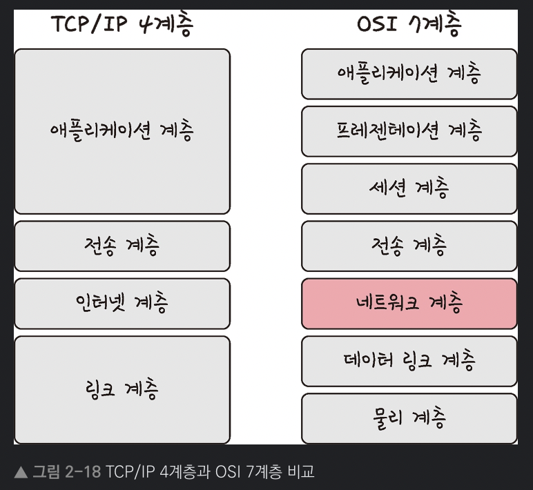

# 2.2.1 계층 구조와 어플리케이션 계층

- 인터넷 프로토콜 스위트(internet protocol suite)
- 인터넷에서 컴퓨터들이 서로 정보를 주고받는데 쓰이는 프로토콜의 집합
    - OSI 7계층 모델 : 이론적인 속성이 강함
    - TCP/IP 4계층 모델 : 실질적인 통신, TCP/IP에 초점을 맞추어 OSI 7계층을 단순화

## 계층 구조

- 네트워크 통신 과정을 단계별로 파악하기 위해, 계층화 하여 설계
- 특정 계층이 변경되어도 다른 계층이 영향을 받지 않도록 유연하게 설계
- 데이터의 캡슐화와 은닉도 가능

## 어플리케이션 계층

- 응용 프로그램이 사용되는 프로토콜 계층
- 서비스를 사람들에게 제공하는 층
- 대표적인 프로토콜
    - FTP : 파일 전송 통신 프로토콜
    - HTTP : 웹을 이용하는데 쓰는 프로토콜
    - SSH : 암호화 네트워크 프로토콜 (원격)
    - SMTP : 전자 메일 전송 프로토콜
    - TELENET : 원격 제어 프로토콜
    - DNS : 도메인 이름과 IP 주소를 매핑 프로토콜
- 다른 종단 시스템에서 실행되는 애플리케이션의 프로세스가 서로 메시지를 보내는 방법을 정의
    - 교환 메시지 타입 (요청 메시지, 응답 메시지)
    - 여러 메시지 타입의 문법 (메시지 내부의 필드와 필드 간의 구별 방법)
    - 필드의 의미, 즉 필드에 있는 정보의 의미
    - 언제, 어떻게 프로세스가 메시지를 전송하고 메시지에 응답하는지 결정하는 규칙

# 레퍼런스

[https://velog.io/@jeanbaek/컴퓨터-네트워킹-2-애플리케이션-계층-1-네트워크-애플리케이션의-원리](https://velog.io/@jeanbaek/%EC%BB%B4%ED%93%A8%ED%84%B0-%EB%84%A4%ED%8A%B8%EC%9B%8C%ED%82%B9-2-%EC%95%A0%ED%94%8C%EB%A6%AC%EC%BC%80%EC%9D%B4%EC%85%98-%EA%B3%84%EC%B8%B5-1-%EB%84%A4%ED%8A%B8%EC%9B%8C%ED%81%AC-%EC%95%A0%ED%94%8C%EB%A6%AC%EC%BC%80%EC%9D%B4%EC%85%98%EC%9D%98-%EC%9B%90%EB%A6%AC)