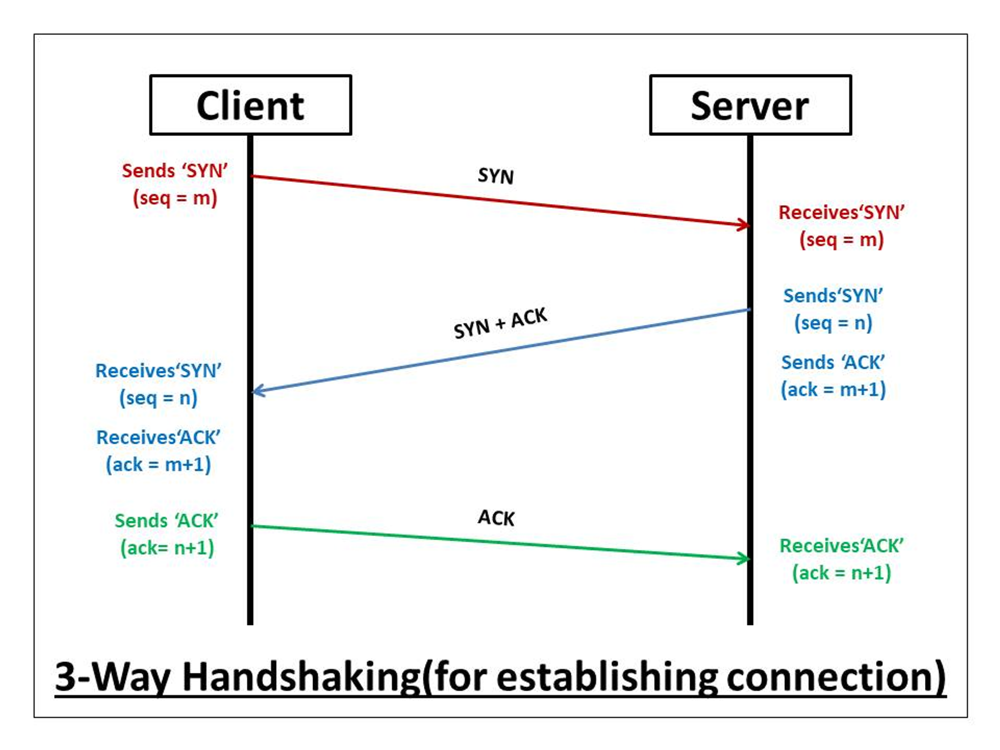
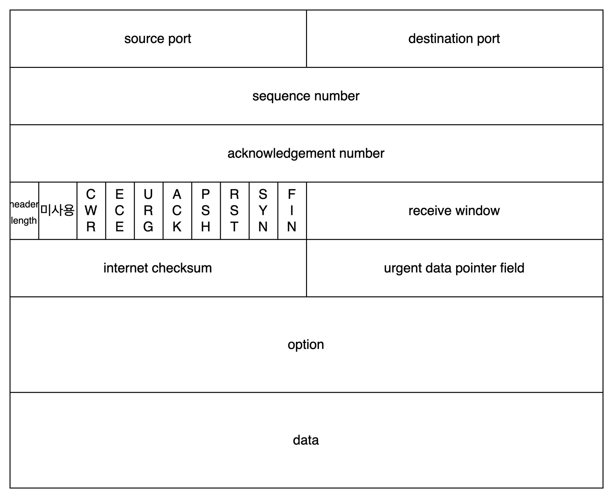
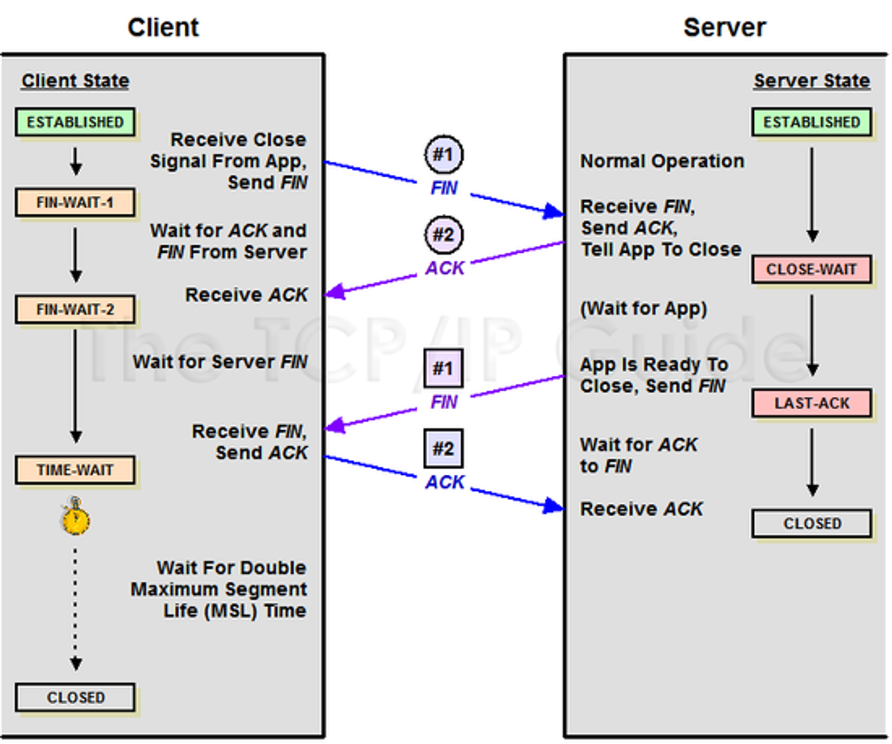

## 전송 계층

- Application Layer와 Transport Layer 두 계층 사이에 Socket 인터페이스를 이용해서 데이터를 전달합니다.

### TCP

- 패킷 사이의 순서를 보장합니다.
- 연결지향 프로토콜을 사용합니다. (가상회선 패킷 교환 방식)
    - 수신 여부를 확인하며 순서대로 패킷을 받습니다.

### UDP

- 순서를 보장하지 않습니다.
- 수신 여부를 확인하지 않습니다.
- 패킷 순서가 다르게 도착할 시 모두 재전송 합니다.

### TCP :: 3-way-handshake

- TCP는 프로세스가 다른 프로세스에 데이터를 보내기 전에,
- 두 프로세스는 ‘`handshake`’ 를 통해 신뢰성을 보장해야 한다.

<aside>
🔥 ISN (Initial Sequence Number)

처음에 클라이언트가 서버로 보내는 SYN(시퀀스넘버)를 ISN이라고 한다.

</aside>

- Client
    - `ISN`을 담은 `SYN`을 보내 접속 요청을 한다.
- Server
    - Client부터 받은 `ISN + 1`을 `ACK`에 담아 `SYN`과 함께 보낸다.
- Client
    - `SYN`과 `ACK`을 받는다.
    - Server가 보낸 `ISN + 1`을 `ACK`에 담아 보낸다.
    

TCP Header `flag` field

- ACK
    - 성공적으로 `segment`를 수신했다는 응답
- SYN : (synchronize sequence numbers)
    - 연결 요청 플래그
    - ISN을 담아 보낸다.
        - ISN은 새로운 TCP 연결의 첫 번째 패킷에 할당된 임의의 sequence number를 의미한다.
- FIN : (finish)
    - 연결 해제 플래그

### TCP : 4-way-handshake

- Client
    - 연결을 해지하겠다는 의미로 `FIN flag`를 전송한다.
    - Client는 `FIN_WAIT` 상태가 된다.
- Server
    - `FIN flag`를 받고, `ACK`를 보낸다.
    - Server는 연결을 종료할 준비를 한다.
        - Server는 `CLOSE_WAIT` 상태가 된다.
    - 연결 종료할 준비가 완료되면 `FIN flag`를 전송한다.
        - Server는 `LAST_ACK` 상태가 된다.
- Client
    - 해지 준비가 되었다는 Server의 응답을 받고 `ACK`를 보낸다.
    - Client는 `FIN_WAIT` 상태에서 `TIME_WAIT` 상태가 된다.
    
    <aside>
    🔥 TIME_WAIT
    
    - 지연 패킷이 발생할 경우를 대비한다.
      - Server가 FIN 전송 전에 데이터를 전송했을 시, 그 데이터는 유실되기 때문에 조금 기다렸다 종료한다.
    - Server가 LAST_ACK 상태일 때 Client가 접속 요청하면 오류가 발생한다.
      - 때문에 기다릴 시간이 필요하다.
    
    </aside>
    
- Server
    - Client로부터 `ACK`를 받고 서버가 `CLOSED` 상태가 된다.
- Client
    - 일정 시간이 지나면 Client도 자원 연결이 해제된다.
    - `CLOSED` 상태가 된다.