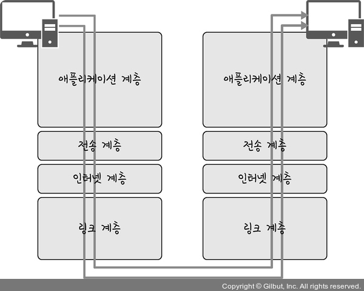

# 네트워크 접근 계층

**`실질적(물리적)`으로 데이터를 전달하며 `장치간의 신호를 주고 받는 규칙`을 정하는 계층**

- 링크(데이터 링크 + 물리) : 네트워크 접근
- 대표적인 프로토콜 : **`이더넷`, `통신 매체(무선, 유선)`**

## 통신 매체(데이터 전달 매체)

- **유선 LAN** : `전 이중화 통신` (양쪽에서 동시에 송수신 가능)
- **무선 LAN** : `반 이중화 통신` (한쪽에서만 송수신 가능)
    
    → 따라서, 반 이중화 통신의 경우 **충돌 방지 시스템** 필요
    
    
    
    

### 유선 LAN(IEEE802.3)

- 유선 케이블 → 대표적으로 트위스트 페어(TP 케이블), 광섬유 케이블
- **트위스트 페어(TP 케이블)** ⇒ 여덟개의 구리선을 두 개씩 꼬아서 묶은 케이블
    
    → **구리선을 실드** **처리**했느냐에 따라 UTP(실드 X), STP 나눠짐
      
    
- **RJ-45 커넥터**

        

- **광섬유 케이블** ⇒ 레이저를 이용한 통신, 장거리, 고속 통신, 빛의 반사를 이용한 통신

       
  
### 무선 LAN(IEEE802.11)

- `CSMA/CA` - 충돌방지 시스템 사용 추가한 프로토콜
    1. 데이터를 송신하기 전에 무선 매체를 살핀다
    2. 캐리어 감지(회선이 비어 있는지 확인)
    3. IFS(Inter FrameSpace): 랜덤한 값만큼 대기, 만약 계속 사용 중인 경우 점차 시간을 늘려감
    4. 이후에 데이터 송신
- 2.4GHz or 5GHz
- **와이파이**: 유선 LAN → 무선 LAN으로 변환하는 기술
- **BSS(Basic Service Set)** : 하나의 AP(Access Point, 무선 접속 장치) 기반으로 구축된 근거리 무선 통신 네트워크 → LAN
- **ESS(Extended Service Set)** : 하나 이상의 연결된 BSS 그룹, 장거리 무선 통신을 지원 → WAN

## 이더넷

- 이더넷 프레임 : 데이터 링크에서 사용하는 데이터 구조
- 이더넷 프레임을 통한 `에러 확인`, `흐름 제어`, `접근 제어`
  

- Preamble: 이더넷 프레임이 시작됨을 알림
- SFD(Start of Frame Delimiter): 다음 바이트부터 MAC 주소 필드가 시작됨을 알림
- Destination Address : 목적지 MAC 주소
- Source Address: 출발지 MAC 주소
- EtherType: 데이터 계층 위의 계층인 IP 프로토콜(인터넷 계층)을 정의 (IPv4, IPv6)
- Data: Payload - 위의 계층에서 내려온 데이터
- FCS(Frame Check Sequence): 에러 확인 비트 (데이터 전송 도중에 오류가 발생하는지 확인하는 용도)

💡 **MAC 주소**
컴퓨터나 노트북, 등 각 장치에는 네트워크에 연결하기 위한 장치(LAN)가 있는데, 이를 구별하기 위한 식별번호. 6바이트(48비트)로 구성, 제조사마다 다르기 때문에 고유한 번호

## 계층 간 데이터 송수신 과정

만약 HTTP를 통해 다른 웹 서버에 있는 데이터를 요청한다면
`애플리케이션 계층`에서 `전송 계층`으로 요청 값(Request)들이 `캡슐화 과정`을 거쳐 전달되고,
`인터넷 계층`을 통해 해당 서버와 통신을 하고, 
해당 서버의 `링크 계층`으로부터 애플리케이션까지 `비캡슐화 과정`을 거쳐 데이터가 전송된다.

> **캡슐화**
> 

상위 계층의 헤더와 데이터를 하위 계층의 데이터 부분에 포함시키고 **해당 계층의 헤더를 삽입하는 과정**

- 애플리케이션 계층 → 전송 계층 : **세그먼트화 또는 데이터그램화** 되며 TCP(L4) 헤더가 붙여지게 된다.
- 전송 계층 → 인터넷 계층 : **패킷화** IP(L3)헤더가 붙여지게 된다.
- 인터넷 계층 → 링크 계층 : **프레임화** 프레임헤더와 프레임 트레일러가 붙여지게 된다.

> **비캡슐화(역캡슐화)**
> 

하위 계층에서 상위 계층으로 가며 각 계층의 헤더 부분을 제거하는 과정

- 비캡슐화 과정을 거쳐 최종적으로 사용자에게 애플리케이션의 PDU인 메시지로 전달된다.

