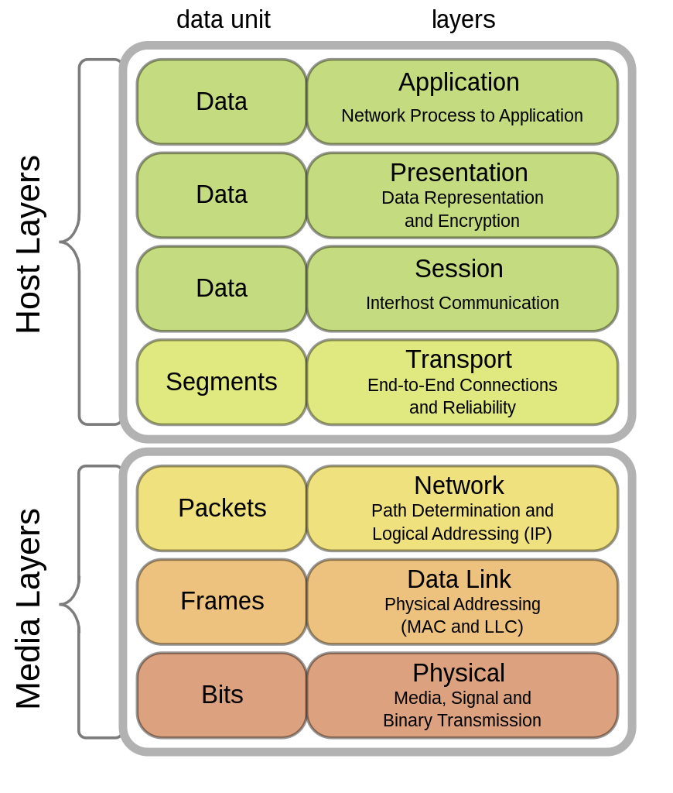

#  PDU(Protocal Data Unit)

어떤 계층에서 계층으로 데이터가 전달될 때 한 덩어리의 단위를 PDU라고 부르며 계층마다 부르는 명칭이 다르다

데이터 자체는 동일하지만 각 레이어를 거치면서 **헤더 정보가 추가되면서 이름이 달라진다**.

>**OSI 7계층**

> **TCP/IP 4계층**
> 
- 애플리케이션 계층 : 메시지
- 전송 계층 : 세그먼트(TCP), 데이터그램(UDP)
- 인터넷 계층 : 패킷
- 링크 계층 : 프레임(데이터 링크 계층) 비트(물리 계층)

<aside>
💡 PDU =  헤더(제어 관련 정보들 포함) + 페이로드(데이터)

</aside>
