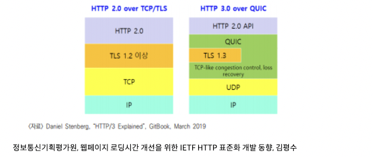

# 2.5.5 HTTP/3
### **TCP가 아닌 UDP 사용**

- HTTP/3은 **`QUIC(Quick UDP Internet Connection) 계층` 위에서 돌아가며**, TCP 기반이 아닌 `UDP 기반`으로 돌아간다.
- QUIC는 **TCP hand shake 과정을 최적화하는 것에 초점을 맞추어 설계되어 있어,** 데이터 그램 방식을 이용하는 UDP 프로토콜을 이용하여 **각각의 패킷 간 순서가 존재하지 않는 독립적인 패킷으로 존재**하도록 하였다.

### 초기 연결 설정 시 지연 시간 감소

- QUIC는 TCP를 사용하지 않기 때문에 3-way-handshake 과정을 거치지 않아도 된다.
- QUIC는 첫 연결 설정에 `1-RTT`만 소요되며 처음 **hand shake를 할 때 연결 설정에 필요한 정보와 데이터를 함께 보낸다.**
(RTT : Round Trip Time. 클라이언트가 요청하고 서버가 처리해 다시 응답해주는 사이클)

### **멀티플렉싱 지원**

- 여러 개의 스트림을 사용하면 특정 스트림의 패킷이 손실되어도 해당 스트림에만 영향을 미치고 나머지 스트림은 멀쩡히 사용할 수 있는 HTTP2 와 똑같은 멀티플렉싱을 지원한다.

### 순방향 오류 수정 메커니즘(FEC : Forword Error Correction)

- QUIC는 순방향 오류 수정 메커니즘이 적용되어 있다.
- 전송한 패킷이 손실되었다면 수신 측에서 에러를 검출하고 수정하는 방식으로 열악한 네트워크 환경에서도 낮은 패킷 손실률을 가진다.

---

## 참고 링크

[HTTP 2, HTTP 3](https://woojinger.tistory.com/85)
